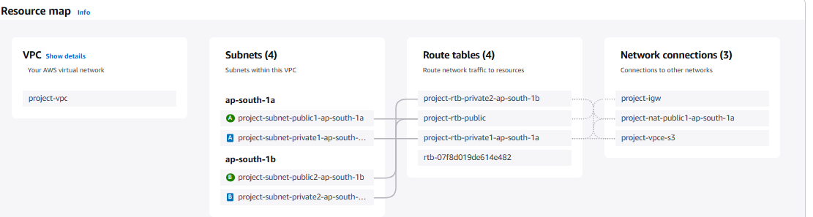

# Day 1 - AWS VPC Workflow (Custom VPC Setup)

## What I Learned
Today I learned how to create a custom Virtual Private Cloud (VPC) in AWS. This includes setting up:
- VPC with custom CIDR block
- Public and private subnets
- Internet Gateway (IGW)
- Route Tables
- NAT Gateway
- S3 Endpoint
- DNS settings

---

## Hands-on Steps I Followed

Here is the detailed workflow I performed in the AWS Console:

1. Create VPC: `vpc-057e927583e47f3c7`
2. Enable DNS Resolution
3. Enable DNS Hostnames
4. Create 4 Subnets:
   - subnet-0d09718ea83a4cd73
   - subnet-0313f4e80877b8b04
   - subnet-08e32c09a1e85d614
   - subnet-045a2e50b6b0a8704
5. Create Internet Gateway: `igw-0c8c48972267035a5`
6. Attach IGW to VPC
7. Create Route Table: `rtb-08ce827cbf0399172`
8. Add Route (0.0.0.0/0 → IGW)
9. Associate Public Subnets with this Route Table
10. Allocate Elastic IP: `eipalloc-0db8323234b2ce8d9`
11. Create NAT Gateway: `nat-0725298bb0423c27b`
12. Wait for NAT Gateway to become active
13. Create Route Table for Private Subnet
14. Add Route (0.0.0.0/0 → NAT Gateway)
15. Associate Private Subnets
16. Create S3 Endpoint: `vpce-07bb2f9d1479dab89`
17. Associate S3 Endpoint with private subnet route tables

---

## Notes:
- I used 2 public and 2 private subnets across different AZs for high availability.
- Used NAT Gateway for internet access from private subnets.
- Enabled S3 Endpoint to allow access to S3 from private subnets without internet.

---

## LinkedIn Summary

Day 1 of #100DaysOfCloud

Today I created a full custom VPC from scratch using AWS Console:
- Subnets (Public & Private)
- IGW, NAT Gateway
- Route Tables
- S3 Endpoint
- DNS Settings

Feeling like a Cloud Engineer already!  
#AWS #VPC #CloudComputing #DevOps #100DaysOfCloud

---

## Screenshot

