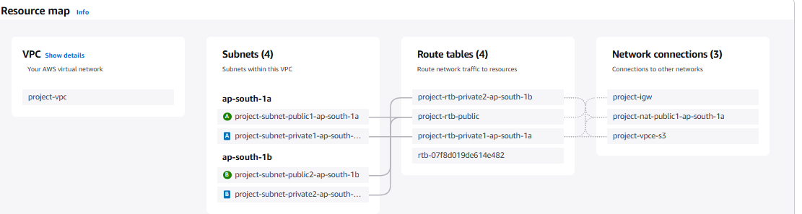

# Day 1 - AWS VPC Workflow (Custom VPC Setup with EC2 & Bastion Host)

## Overview  
Is project mein maine AWS Console se ek **Custom Virtual Private Cloud (VPC)** banaya jisme maine multiple components configure kiye hain for secure, scalable networking and compute:

- Custom VPC with CIDR block `10.0.0.0/16`
- Public and private subnets across multiple Availability Zones (AZs)
- Internet Gateway (IGW) and NAT Gateway for internet access
- Route Tables for public and private subnets
- S3 VPC Endpoint to access S3 securely from private subnets
- EC2 instances deployed in public and private subnets
- SSH and SSM Agent based secure connectivity to EC2 instances
- Bastion Host in public subnet for secure jump-server access to private instances

---

## Architecture Diagram  

---

## Detailed Setup and Resources

### 1. VPC Setup  
- **VPC ID:** `vpc-057e927583e47f3c7`  
- **CIDR Block:** `10.0.0.0/16`

### 2. Subnets  
| Subnet Name                          | Subnet ID                | CIDR Block       | AZ            | Type      | Route Table                      |
|------------------------------------|--------------------------|------------------|---------------|-----------|---------------------------------|
| project-subnet-public1-ap-south-1a | `subnet-0d09718ea83a4cd73` | `10.0.0.0/20`     | ap-south-1a   | Public    | `rtb-08ce827cbf0399172` (public)|
| project-subnet-public2-ap-south-1b | `subnet-0313f4e80877b8b04` | `10.0.16.0/20`    | ap-south-1b   | Public    | `rtb-08ce827cbf0399172` (public)|
| project-subnet-private1-ap-south-1a| `subnet-08e32c09a1e85d614` | `10.0.128.0/20`   | ap-south-1a   | Private   | `rtb-0247741b7fce3794` (private)|
| project-subnet-private2-ap-south-1b| `subnet-045a2e50b6b0a8704` | `10.0.144.0/20`   | ap-south-1b   | Private   | `rtb-065b8d5d07e705e96` (private)|

### 3. Internet Gateway (IGW)  
- **IGW ID:** `igw-0c8c48972267035a5`  
- Attached to VPC `vpc-057e927583e47f3c7` to provide internet access for public subnets.

### 4. NAT Gateway  
- **NAT Gateway ID:** `nat-0725298bb0423c27b`  
- Allocated Elastic IP: `13.235.204.130`  
- Allows outbound internet access from private subnets while keeping instances private.

### 5. Route Tables  
- **Public Route Table:** `rtb-08ce827cbf0399172`  
  - Routes:  
    - `0.0.0.0/0` → `igw-0c8c48972267035a5` (Internet Gateway)  
  - Associated Subnets: Both public subnets

- **Private Route Tables:**  
  - `rtb-0247741b7fce3794` (private1 subnet)  
  - `rtb-065b8d5d07e705e96` (private2 subnet)  
  - Routes:  
    - `0.0.0.0/0` → `nat-0725298bb0423c27b` (NAT Gateway)

### 6. S3 VPC Endpoint  
- **Endpoint ID:** `vpce-07bb2f9d1479dab89`  
- Type: Gateway Endpoint for S3  
- Allows private subnets to access S3 without needing internet connectivity.

---

## EC2 Instances & Access Setup

### EC2 Instances  
- Launched EC2 instances in both **public** and **private** subnets.  
- Instances in public subnets have public IPs to allow direct SSH.  
- Instances in private subnets use **SSM Agent** for secure shell access without public IPs.

### Bastion Host  
- Configured a Bastion Host in the public subnet (`subnet-0d09718ea83a4cd73`) for secure SSH jump to private subnet instances.  
- Bastion has a public IP and security group allowing inbound SSH from trusted IPs only.  
- Private instances accept SSH only from Bastion Host’s security group.

### Access Methods  
- **SSH:** For public subnet instances and Bastion Host.  
- **AWS Systems Manager (SSM) Agent:** For private subnet instances to connect securely without public IPs or SSH keys.

---

## Notes & Best Practices

- Multiple AZs used for high availability and fault tolerance.  
- Private subnets secured with NAT Gateway for outbound internet.  
- S3 Endpoint enables efficient and secure access to S3 from private instances.  
- Bastion Host improves security posture by restricting direct access to private instances.  
- SSM Agent eliminates need for managing SSH keys and public IP exposure for private instances.

---

